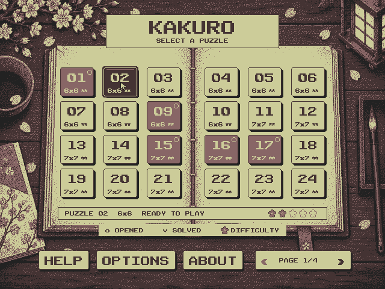
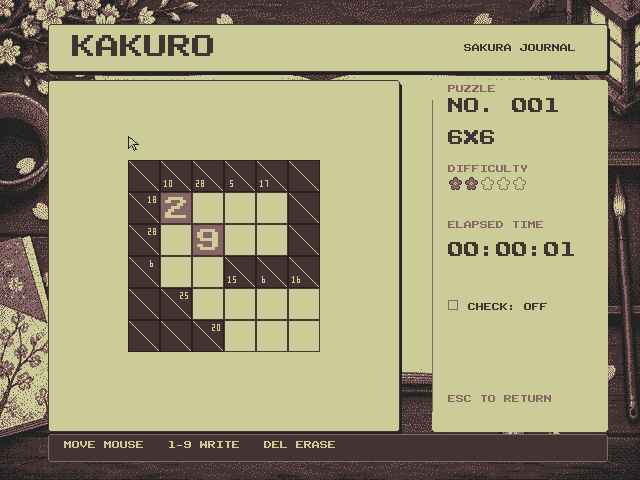
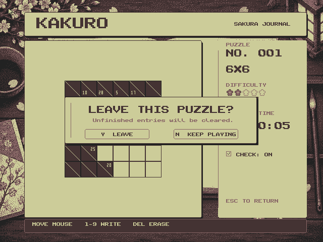
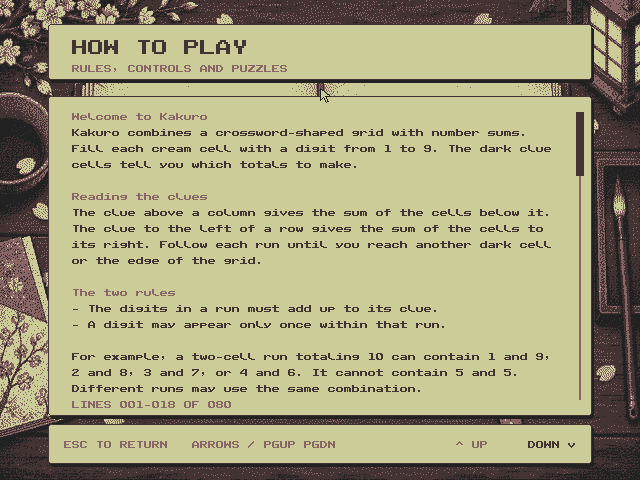
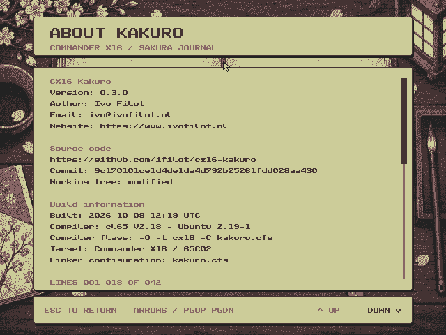

# CX16-KAKURO


[](https://github.com/ifilot/cx16-kakuro/actions/workflows/build.yml)
[](https://www.gnu.org/licenses/gpl-3.0)

[Download latest version](https://github.com/ifilot/cx16-KAKURO/releases/latest/download/CX16-KAKURO.ZIP)

**Puzzle selection**



**Gameplay**



## Description

Kakuro is a logic-based number puzzle game, often described as a cross between a
crossword and Sudoku. In this game, players fill a grid with digits from 1 to 9,
with the objective of matching the sum of numbers in each row or column to a
given target. However, no number can be repeated within a single sum. Each clue
is represented as a small number in a black cell, dictating the sum of the
digits to be placed in the adjacent white cells.

For the Commander X16, Kakuro offers a nostalgic experience, blending the
puzzle's classic challenge with the retro charm of 8-bit computing. Players
navigate the grid using the mouse and inputting numbers via keyboard. The game
tests mathematical reasoning and strategic thinking, making it an engaging
pastime for puzzle enthusiasts and retro gaming fans alike. The simplistic yet
captivating design ensures that Kakuro on the Commander X16 is both a mental
workout and a tribute to vintage gaming.

## Features

* In total, **96** puzzles are available in a Japanese journal menu, with
  **24 puzzles per page** across four pages.
* A sakura courtyard start screen welcomes the player. Press **Enter** to
  open the puzzle menu.
* The journal has large puzzle cards, hover highlights, opened/solved badges,
  difficulty indicators, and Help, Options, and About buttons. Use the mouse
  or arrow keys and **Enter** to choose a puzzle. Options toggles music.
* The program keeps track of the user progression. Different colors are used to
  indicate opened and completed puzzles. The game automatically saves the result
  to `PUZZLE.DAT` ensuring 'continuous play'. Note that the game state itself
  is not saved.
* If the user is stuck, they can hit a toggle button which highlights all
  correct numbers in green, while incorrect numbers are colored in red.

## Compilation

First, install the required dependencies

```bash
sudo apt-get install -y build-essential cc65 python3 python3-numpy python3-pil zip unzip
```
Run `make` from the repository root to compile the program.

```bash
make
```

Run `make dist` to build and package the program as `build/CX16-KAKURO.ZIP`.
The ZIP contains the program, data assets, music, sound effects and Help/About
text files, with no subdirectories. Each run replaces the previous ZIP and
checks its integrity. GitHub Actions uses the same target.

To build and launch the game in the emulator, run:

```bash
make run
```

Press **Enter** on the courtyard start screen to open the puzzle menu. The
start screen uses a native 640x480 four-color bitmap with dithering, using
colors from `assets/palette/cx16palette.png`. The build generates
`SPLASH0.DAT`, `SPLASH1.DAT`, and `SPLASHP.DAT` from the selected four-color
image at `assets/backgrounds/start.png`; include all three files alongside the
program when distributing it. The start screen and later scenes share the
same palette, with a paper-colored fade between them.

The journal menu uses the same four colors at 640x480. The build generates
`JOURNAL*.DAT`, `JPALET.DAT`, `JCURSOR.DAT`, `JPAGE*.DAT`, `JDETAIL*.DAT`,
`JUI.DAT`, `JRESTORE.DAT`, and `JDIALOG.DAT`; distribute these with the other files in `src`.
The menu needs the default 512 KiB of banked RAM. Controls use banks 7–15,
cards use 16–27, and details use 28–63. Hover updates copy cached rectangles
with a 65C02 routine instead of drawing text pixel by pixel. Each scene loads its own journal artwork beneath the paper-colored transition.


Gameplay uses the same four colors and sakura artwork at 640x480. A paper
board holds the puzzle, with rose given numbers, cream writing cells, and
dark clue cells. The sidebar shows the puzzle number, size, difficulty and
timer, plus a small **Check** toggle. Sidebar controls
use an underline on hover, keeping attention on the board. Hover over a writing cell and
type 1–9; Backspace/Delete or 0 clears it. Verification marks correct entries
with a small check and incorrect entries with a rose cross. Escape opens
the confirmation dialog; Y returns to the journal and N resumes play.
Difficulty uses five-petal sakura blossoms inspired by the DOS version:
filled flowers show the rating, with outlined flowers completing a row of
five. The menu details use the same display, and cards have compact blossom
marks beside their size.

`GPLAY0.DAT`, `GPLAY1.DAT`, `GTILES.DAT`, `GCONTROLS.DAT` and `GQUIT.DAT` are generated
by the build and must also accompany the program. The scenery is a 2bpp
bitmap; a 4bpp tile layer renders the board and sidebar text. Hover changes
four map entries rather than redrawing the bitmap. The overlay map is kept
above the tile atlas so clues, fonts and dialogs cannot overwrite one another.
Blocked cells share the clue cells' full diagonal. The exit dialog has
mouse buttons, Y/N shortcuts and Escape to cancel; cancelling restores both
the board overlay and background exactly.




Help and About use matching paper reading pages at 640x480, with rose
section headings, generous line spacing, a scrollbar and reading progress.
Scroll with Up/Down, Page Up/Page Down, Home/End, the mouse wheel, or the
footer controls. Clicking above or below the scrollbar thumb moves a page.
Escape returns to puzzle selection. Text comes from
`src/HELP.TXT` and `src/ABOUT.TXT`; `make` wraps it and regenerates the
`DHELP*.DAT`, `DABOUT*.DAT` and `DCONTROL.DAT` assets, which must accompany
the program. Text and scrollbar redraws take about 14 ms at 8 MHz. About is a technical
page showing the author, version, GitHub URL, full HEAD commit, working-tree
status, compiler version, flags and hardware configuration. `VERSION` is the
version source. `make` generates `src/BUILDINFO.json`; its timestamp changes
when the recorded source inputs or build settings change, and remains stable
for an unchanged build. A modified tree is explicitly labelled, since the
HEAD commit alone does not describe uncommitted changes.





Scene transitions retain a visible bitmap throughout loading. A short
palette fade moves to the paper color, masks writes to the bitmap and overlay,
then reveals the completed scene. Music continues during the transition.
Two full 640x480 2bpp buffers need 153,600 bytes; VERA only has 131,072 bytes,
so a second complete bitmap cannot coexist with the first and the tile atlas.

The start screen prepares puzzle data and the journal's RAM caches while
remaining visible; Enter pressed during preparation stays buffered. Startup
no longer loads the obsolete menu/game tiles, 16px font or small-digit builder.
Returning to the journal retains its current page's cards and details. Only
the first two control banks are restored, since gameplay and documents reuse
those banks. This reduces a warm journal return from approximately 537 KB of
asset reads to 93 KB, an 83% reduction. Gameplay retains its atlas across
journal visits; documents invalidate it because their text map overlaps it.
Map clearing and dialog map transfers now use assembly page loops.

The following measurements use the AgentBridge emulator at 8 MHz and include
input delivery, scene rendering, music and the fade. Storage and emulator-host
wall time are separate from these CPU measurements; samples vary with frame
phase.

| Transition | Previous | Updated |
| --- | ---: | ---: |
| Start to journal | 182 ms | 134 ms |
| Journal to Help | 213 ms | 84 ms |
| Help to journal | 152 ms | 134 ms |
| Journal to first puzzle | 126 ms | 120 ms |
| Puzzle to journal | 176 ms | 137 ms |

Remaining costs are the bitmap uploads and rebuilding the visible cards or
board. Packing repeated colors could reduce the four journal/game/document
backgrounds from 307,200 to about 99,090 bytes in RAM. The existing detail
records also contain about 123 KiB of padding. Compacting both could permit
more background residency, but would add decompression work on the 65C02;
it should be measured against real SD-card loading before replacing the
current fast rectangle caches. The implemented transition avoids corrupting
live tiles and requires the existing 512 KiB RAM configuration.

`python3 tests/check_transitions.py` reproduces the latency measurements,
checks that the bitmap layer stays enabled during each switch, and checks
keyboard and mouse cancellation of the exit dialog.

To export the actual compiled graphics as PNG sheets for inspection:

```bash
make tilesheets
```

The exports are in the ignored `build/tilesheets` directory. `game-tiles.png` preserves the
351 native 16x16 hardware tiles and transparency; `game-tiles-labeled.png`
adds tile IDs. `game-cells.png` assembles the 32x32 cell states for comparison.
Separate sheets show clues, fonts, dialog borders, the cursor, and current
game/menu controls. `journal-page-1.png` through `journal-page-4.png` show
all four card states for every puzzle. Background bitmaps and the start
screen are included. `index.json` records the formats, source assets and
tile ranges. These previews decode the `.DAT` files generated by `make`.

`python3 tests/check_asset_sources.py` checks a fresh build and verifies that
cell and charmap pixel edits propagate into game assets through `make`, using
a temporary workspace.

By default, this uses `../x16-emulator/build/x16emu` and
`../emulator/rom.bin`. Override `EMU`, `ROM`, or `EMU_FLAGS` as needed:

```bash
make run EMU=/path/to/x16emu ROM=/path/to/rom.bin EMU_FLAGS="-scale 3"
```

On Windows, double-click `run.bat`, or run it from Command Prompt. It builds
the game using your default WSL distribution, then launches a native Windows
emulator with `src` as the working directory. It prefers a Windows build of
the new emulator and falls back to `../emulator/x16emu.exe`. The Linux
`build/x16emu` executable cannot run natively on Windows.

To build the new emulator for Windows, run `build-emulator-windows.bat` once.
It uses MSYS2 UCRT64 at `C:\msys64`, builds a Release executable in
`build/windows-emulator`, and copies its runtime DLLs alongside it. The script
prints the required package installation command if tools are missing.
Then run `run.bat`; it automatically selects that build. Set `MSYS2_ROOT` if
your MSYS2 installation is elsewhere. MIDI support is disabled in this
emulator build; the game's ZSM music remains available.

Launcher overrides in Command Prompt:

```bat
set "X16_EMU=C:\path\to\x16emu.exe"
set "X16_ROM=C:\path\to\rom.bin"
rem Optional: use the already-built game without invoking WSL.
set "KAKURO_SKIP_BUILD=1"
run.bat
```

Extra arguments are forwarded, for example `run.bat -fullscreen`.

Audio assets are stored in `assets/sound`; `make` copies `MENU.ZSM`,
`GAME.ZSM` and `SFX.BIN` into `src`. Distribute all three with the program.
The Music option controls the background track; effects remain enabled.
See [the audio asset notes](assets/sound/README.md) for updating the bundle.

To verify menu interactions using the neighboring AgentBridge emulator:

```bash
python3 tests/check_journal.py --screenshots /tmp/journal-check
python3 tests/check_playfield.py --screenshots /tmp/playfield-check
python3 tests/check_documents.py --screenshots /tmp/document-check
python3 tests/check_audio.py
python3 tests/check_transitions.py
```

To check hover responsiveness against one 60 Hz frame at 8 MHz:

```bash
python3 tests/benchmark_menu.py --max-cycles 133334
python3 tests/benchmark_menu.py --progress --max-cycles 133334
```

## Dependencies

CX16-KAKURO makes use of [zsmkit](https://github.com/mooinglemur/zsmkit) which
is an advanced music and sound effects engine for the Commander X16 and
available under a MIT License. A static copy of this library is bundled in
this repository and automatically embedded in the `.PRG` file.

## Assets

The live graphics sources are plain PNG sheets. `make` runs the Python
converters and compiles the resulting assets into the game's build. Editing
these inputs and running `make run` updates the game.

| Source | Layout and use | Converter / output |
| --- | --- | --- |
| `assets/tiles/ui-charmap.png` | 128×48; 16×6 glyphs of 8×8 pixels, ASCII 32–127, left to right. Alpha defines the glyph mask. Used by menus, documents, dialogs and the board font. | `create_fontmap.py` → `FONT8.DAT`; scene builders also read it directly. |
| `assets/tiles/clue-charmap.png` | 40×8; ten 4×8 digits, 0–9. Light pixels define the clue digit mask. | `create_playfield.py` → clue tiles in `GTILES.DAT`. |
| `assets/tiles/cells.png` | 224×224; 7×7 cells of 32×32 pixels. All 49 cell states, in the row-major order named in `layout.json`. | `create_playfield.py` → four 16×16 hardware tiles per cell in `GTILES.DAT`. |
| `assets/tiles/dialog-borders.png` | 80×16; five 16×16 tiles: top, side, top corner, bottom, bottom corner. | `create_playfield.py` → `GTILES.DAT`. |
| `assets/tiles/difficulty.png` | 48×16; filled and outline blossoms in the first two 16×16 slots; compact 5×5 blossom at (32,0). Transparent pixels reveal the paper. | `difficulty.py` renders journal badges; `create_playfield.py` packs board blossoms into `GTILES.DAT`. |
| `assets/backgrounds/start.png` | Approved 640×480 four-color start screen. | `create_splash.py` → `SPLASH*.DAT`. |
| `assets/backgrounds/journal.png` | Shared journal scenery, resized and quantized to 640×480. | Menu, playfield and document builders → their background `.DAT` files. |

`assets/tiles/layout.json` names the cell states and sheet layouts. The playfield
converter generates `src/tile_layout.h`, which `playfield.c` includes for cell
kinds and tile offsets. This keeps the atlas and C references in sync. The
screen tilemaps themselves are assembled at runtime from puzzle data and these
tile IDs; the PNGs are source tilesheets and charmaps.

Keep cell pixels in the four game colors: `#cccc99`, `#886666`, `#443333`,
`#222222`. Edit at native resolution without antialiasing. Use transparency
for UI glyph masks and difficulty symbols. `make tilesheets` exports labeled
views of the compiled graphics to `build/tilesheets` for inspection.

The courtyard and journal scenery were generated with OpenAI's image generator;
the selected prompts are in `assets/backgrounds/prompts.json`. The original
bitmap glyphs and cell artwork were created by me. No permission is required
to reuse that artwork; attribution is appreciated. Unused concepts, editable
project files and legacy sheets have been removed.

* Music and effects come from `cx16-sound-generator`'s Kakuro project.
  **Niwa** plays on the start screen, journal, Help and About; **Quiet Grid**
  plays during puzzles. The 18 effects cover navigation, nine digit pitches,
  checking, wrong entries, dialogs and completion.

## Community guidelines

* Contributions to CX16-Othello are always welcome and appreciated. Before doing so,
  please first read the [CONTRIBUTING](CONTRIBUTING.md) guide.
* For reporting issues or problems with the software, you are kindly invited to
  to open a [new issue with the bug label](https://github.com/ifilot/cx16-othello/issues/new?labels=bug).
* If you seek support in using CX16-Othello, please 
  [open an issue with the question](https://github.com/ifilot/cx16-othello/issues/new?labels=question)
  label.
* If you wish to contact the developers, please send an e-mail to ivo@ivofilot.nl.

## License

Unless otherwise stated, all code in this repository is provided under the GNU
General Public License version 3.

## Browser game and GitHub Pages

`make site` builds the game, creates its distribution ZIP and generates a
self-contained website in `build/site`. The first build downloads the official
X16 WebAssembly release r49 into `build/site-cache` and verifies its SHA-256.
Subsequent builds reuse that archive. Emscripten is not required locally.
The matching ROM data, emulator JavaScript, WebAssembly, and game files are all
served from the generated site, without a third-party runtime dependency.

To preview it locally:

```bash
make site
python3 -m http.server 8000 --directory build/site
```

Open `http://localhost:8000`, click **Start game**, then press **Enter** to select
a puzzle. Use the mouse and number keys to play. The embedded display is exactly 640×480
CSS pixels. Fullscreen uses the largest integer multiple of the native
framebuffer that fits in the available physical pixels, with centered borders
and no interpolation. On small or touch screens, the native-size viewport
scrolls: swipe to pan, tap to select, and use the on-screen digit/Del/Enter/Esc
keys. Landscape gives more space; narrow fullscreen views retain panning
instead of shrinking the board. The website provides sound,
fullscreen and restart controls, rules, technical details and a downloadable
ZIP. Browser progress lasts for the current session; reloading starts fresh.
Site builds generate fresh puzzle data without changing desktop save files.

The `.github/workflows/pages.yml` workflow builds, browser-tests and deploys
GitHub Pages only on pushes to `master`. Manual runs also require `master`.
Pull requests, `develop`, and version tags do not deploy the website. Pages
must use **GitHub Actions** as its build source in the repository settings.

The browser regression check runs the bundled emulator under a project URL
subpath and verifies rendered scenes against the game's packed graphics:

```bash
npm install --prefix build/browser-tools playwright@1.64.0
build/browser-tools/node_modules/.bin/playwright install chromium
NODE_PATH="$PWD/build/browser-tools/node_modules" node tests/check_site.cjs
```

Screenshots are saved to `build/site-check`, outside the published website.
